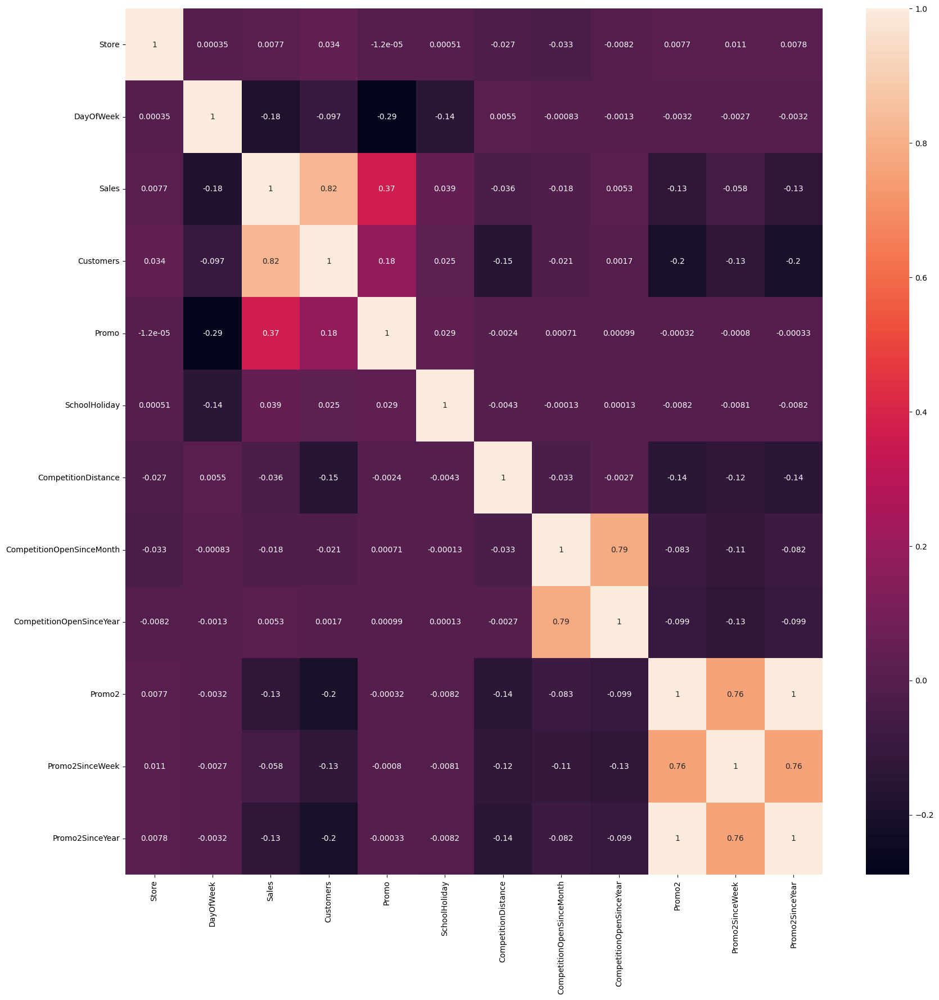
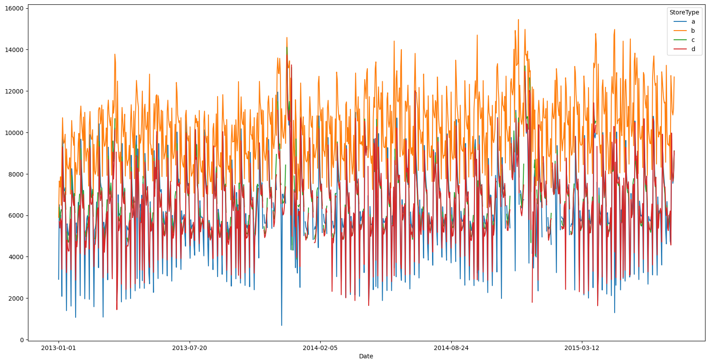
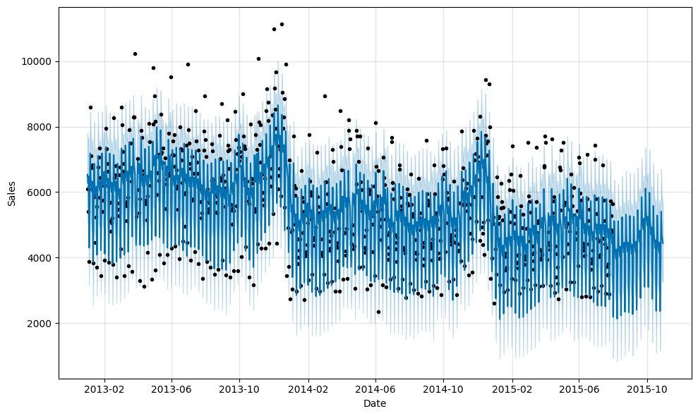

# Time Series Forecasting of Daily Sales for Retail Stores Using Facebook Prophet: Incorporating Seasonality, Promotions, Holidays, and Competitive Factors

Time series forecasting project leveraging Facebook Prophet to predict daily sales trends for 1115 stores, accounting for seasonality, promotions, holidays, and competition.


## Introduction

Accurate sales forecasting is essential for businesses to optimize operations and plan future strategies. This project builds predictive models to forecast future sales based on historical data, enabling better decision-making in competitive environments.


## Dataset
https://www.kaggle.com/c/rossmann-store-sales/data
## Key Features

Sales Data: Sales, customers, promotions, and holidays.

Store Attributes: StoreType, Assortment, CompetitionDistance, and more.

Temporal Features: Holidays, school closures, promotional intervals.
## Models Used

Facebook Prophet:
    
    Designed for time series data with seasonal effects.

    Incorporates yearly, weekly, daily seasonality, and holiday effects.

    Open-source software for scalable forecasting.

# Methodology

## Exploratory Data Analysis (EDA)
EDA is a critical phase in the project, helping us understand the data, identify trends, and prepare it for modeling. The following steps were carried out:

### 1. Data Inspection:

Loaded datasets train.csv and store.csv.
Reviewed the structure, types, and sample entries of each dataset.
Identified key features like Sales, Promo, StateHoliday, Customers, and store metadata.

### 2. Data Cleaning:

Checked for missing values and handled them:
For CompetitionDistance, missing values were imputed with a default value or the median.
For promotional variables (Promo2 and related features), filled missing values with "0" or "No Promo."
Converted Date to a proper datetime format for time-series analysis.

### 3. Data Visualization:

Time-series plots to observe sales trends over time.
Boxplots to visualize the distribution of sales across different store types (StoreType, Assortment).
Correlation heatmaps to identify relationships between variables.

### 4. Feature Relationships:

Analyzed the relationship between Sales and:
Customers: Strong correlation observed.
Promo and Promo2: Sales were higher during promotions.
Holidays (StateHoliday, SchoolHoliday): Significant variations in sales.

### 5. Seasonality and Trends:

Decomposed the sales time series into components (trend, seasonality, and residuals).
Observed yearly and weekly seasonality patterns, along with periodic spikes during holidays.

## Training Process
The training phase involves building a time-series model using Facebook Prophet:

### 1. Data Preparation:

Filtered the dataset to focus on relevant columns:
ds (Date) and y (Sales) for Prophet.
Merged the sales data with store metadata to incorporate additional features like promotions and holidays.
Scaled/normalized data where necessary to handle variations.

### 2. Modeling with Facebook Prophet:
Configured Prophet for:
Trend Analysis: Capturing the long-term upward or downward trend in sales.
Seasonality: Adding yearly, weekly, and daily seasonal components.
Holiday Effects: Included state and school holidays as regressors.
Split the data into training and test sets to evaluate performance.

### 3. Parameter Tuning:
Adjusted Prophet’s hyperparameters, such as:
Changepoint Prior Scale: To control flexibility in trend changes.
Seasonality Prior Scale: To emphasize or reduce seasonality effects.
Fine-tuned holiday-specific effects using additional regressors.

### 4. Training:
Trained Prophet on the historical sales data to capture underlying patterns.
Incorporated external features like Promo, CompetitionDistance, and PromoInterval using custom regressors.

## Prediction Process
 The prediction phase involves forecasting future sales and evaluating model performance:

### 1. Forecasting:
Generated sales forecasts for the test set using the trained Prophet model.

Predicted values included:

Point estimates (yhat).

Uncertainty intervals (yhat_lower, yhat_upper).

### 2. Evaluation:
Compared predicted sales (yhat) against actual sales from the test set.
Calculated metrics:

MAPE (Mean Absolute Percentage Error): To express error as a percentage.


### 3. Insights from Predictions:
The model accurately captured sales spikes during promotions and holidays.
Uncertainty intervals provided confidence ranges for predictions, ensuring reliability in decision-making.


### 4. Visualization of Results:
Plotted actual vs. predicted sales to assess performance visually.
Residual plots revealed any patterns in prediction errors, ensuring no systemic biases


## Deployment

To clone this project run

```bash
  git clone https://github.com/your-username/Sales-Forecasting-With-Prophet.git
cd Sales-Forecasting-With-Prophet

```

Install Dependencies

```bash
  pip install -r requirements.txt


```


## Acknowledgements

 - [FB Prophet](https://facebook.github.io/prophet/)


## Screenshots





## 🔗 Links
[](https://mdtowsif1101.wixsite.com/my-site-1)
[](https://www.linkedin.com/in/ekramulhaque110/)

