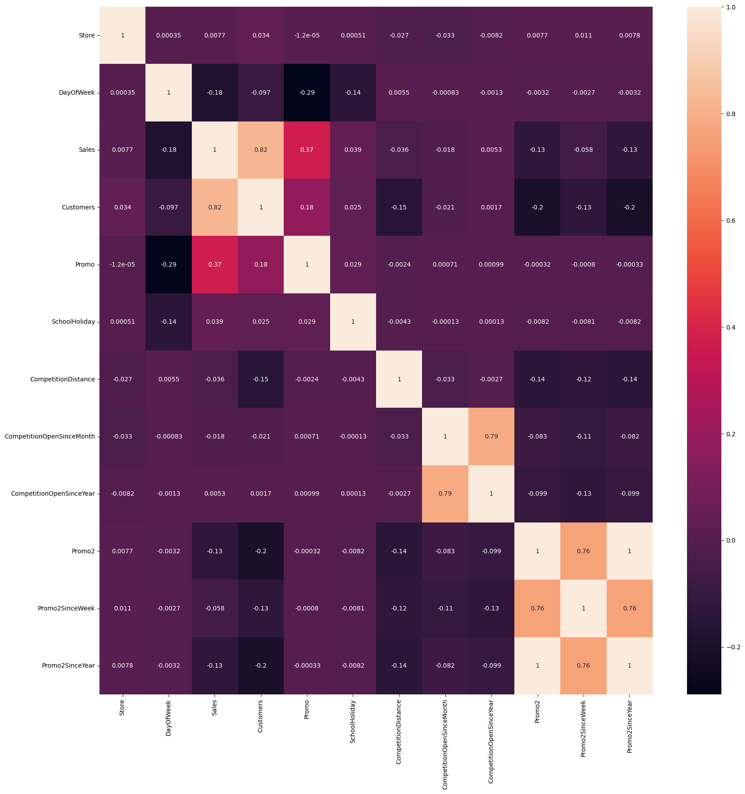
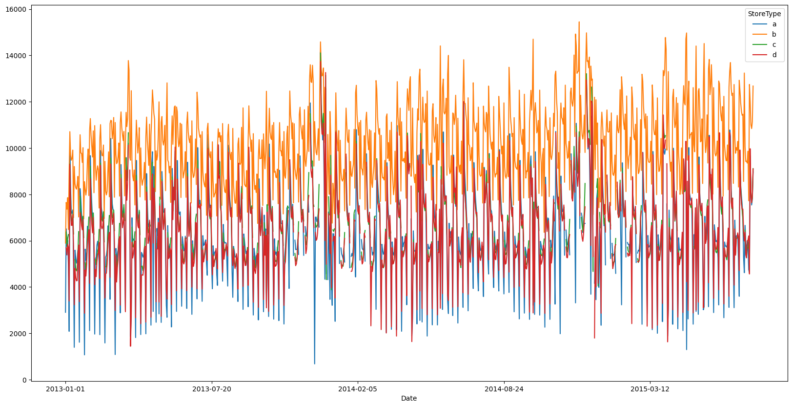
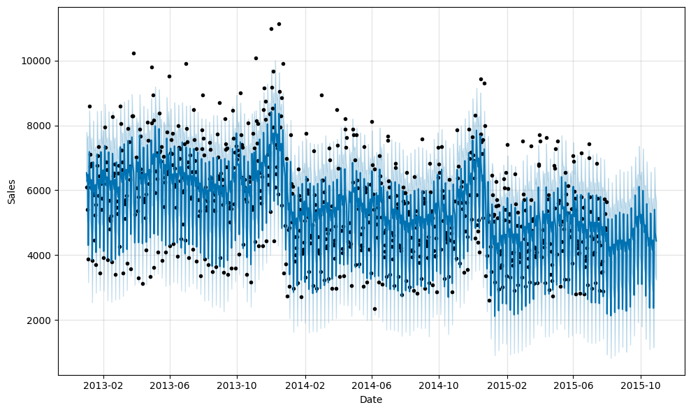

# Time Series Forecasting of Daily Sales for Retail Stores Using Facebook Prophet

Exploratory analysis and Prophet forecasting of daily sales for the 1,115 Rossmann drugstores, with school and state holiday effects, plus an out-of-sample evaluation against simple baselines.

## Dataset
[Rossmann Store Sales (Kaggle)](https://www.kaggle.com/c/rossmann-store-sales/data): `train.csv` (daily sales per store, 2013-01-01 to 2015-07-31) and `store.csv` (store attributes, included in this repo). Download `train.csv` into a `data/` folder to rerun the analysis.

## Key findings from the exploratory analysis
All numbers are printed in the notebook.

- **1,017,209 store-days**, of which **172,817 (17%)** were closed days; the analysis uses the **844,392 open store-days**.
- **Customer count is the strongest driver of sales:** correlation **0.82**, so customers explain about two-thirds of the day-to-day variation in sales.
- **Promotions lift sales:** correlation between sales and the daily promo flag is **0.37**; promos ran on 45% of open days.
- Average daily sales on open days: **6,956** (median 6,369).
- 571 of 1,115 stores (51%) take part in the long-running Promo2 program.

## Data cleaning (store.csv)
- `CompetitionDistance`: 3 missing values filled with the column mean.
- `CompetitionOpenSinceMonth/Year` (354 missing) and `Promo2SinceWeek/Year`, `PromoInterval` (544 missing): filled with 0 (no competition date / no Promo2).
- `train.csv` has no missing values; closed days (`Open = 0`) are removed before modeling.

## Modeling with Prophet (notebook)
- Prophet with yearly and weekly seasonality.
- School and state holidays added as holiday effects.
- Forecasts with uncertainty intervals (`yhat_lower`, `yhat_upper`) and component plots (trend, weekly, yearly, holidays).
- The notebook reports **MAPE 14.92% for Store 6**. This is an **in-sample** figure (the model is scored on the same days it was trained on), so it describes fit, not forecast accuracy. The holdout evaluation below measures accuracy on unseen days.

## Holdout evaluation (`evaluate_holdout.py`)
To measure real forecast accuracy, the script holds out the **last 6 weeks** (2015-06-20 to 2015-07-31, the Kaggle competition horizon), trains every model only on earlier data, and scores all models on the same held-out open days.

| Model | Description |
|---|---|
| `naive_last_week` | Each held-out day gets the sales of the same weekday in the last training week |
| `weekday_avg_8w` | Average sales for that weekday over the last 8 training weeks |
| `prophet_holidays` | Prophet with the store's school and state holidays (as in the notebook) |
| `prophet_promo` | The same, plus the promo flag as a regressor (promos are planned in advance) |

Metrics: MAPE and RMSPE (the Kaggle competition metric) on open days with sales > 0.

```bash
pip install -r requirements.txt
python evaluate_holdout.py --train data/train.csv --stores 50   # 50 random stores (seed 42)
python evaluate_holdout.py --train data/train.csv --all         # all 1,115 stores (slow)
```

Results are written to `results/holdout_summary.md` and `results/holdout_by_store.csv`.

### Results (50 random stores, seed 42)

| Model | Mean MAPE (%) | Median MAPE (%) | Mean RMSPE (%) |
|---|---|---|---|
| naive_last_week | 24.20 | 23.72 | 32.76 |
| weekday_avg_8w | 21.20 | 21.03 | 26.33 |
| prophet_holidays | 19.02 | 18.74 | 23.06 |
| prophet_promo | 11.33 | 10.44 | 14.30 |

Best Prophet model (`prophet_promo`) vs best baseline (`weekday_avg_8w`): mean MAPE 11.33% vs 21.20%, a 46.6% relative reduction in error; Prophet had the lower MAPE in 98% of stores.

## Screenshots




## Acknowledgements
- [Prophet](https://facebook.github.io/prophet/)
- Data: Rossmann Store Sales, Kaggle

## 🔗 Links
[](https://mdtowsif1101.wixsite.com/my-site-1)
[](https://www.linkedin.com/in/ekramulhaque110/)
